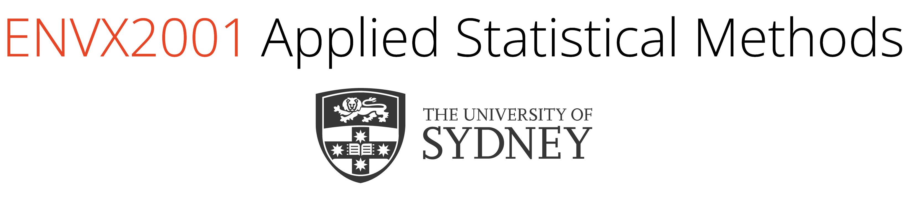

## Lecture Topic 2a - Sampling Designs I

[HTML][HTML] [PDF][PDF]

**Dr. Januar Harianto** | Semester 1, 2024

**License and attribution**: This work was developed using resources that are available under a [Creative Commons Attribution 4.0 International license][cc-by], made available on the [SOLES Open Educational Resources repository][soles-oer].

[cc-by]: http://creativecommons.org/licenses/by/4.0/
[soles-oer]: https://github.com/usyd-soles-edu

[HTML]: https://envx-resources.github.io/ENVX2001-2024-Lecture-Topic02a/
[PDF]: https://envx-resources.github.io/ENVX2001-2024-Lecture-Topic02a/Lecture-02a.pdf